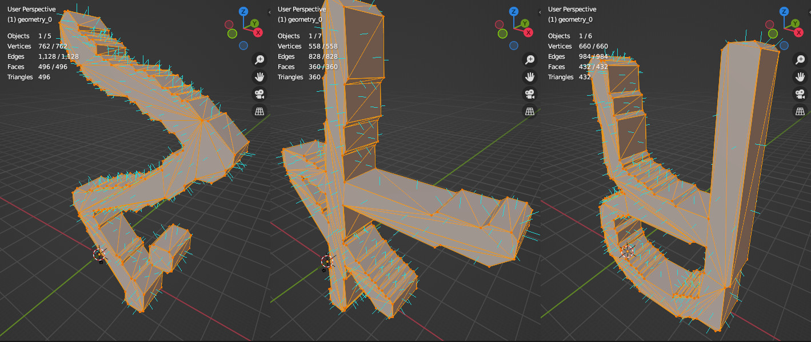

# Omniglot3D   

## Overview
This is 3D meshes of letters created out of [Omniglot dataset](https://github.com/brendenlake/omniglot).  
Each letter represented as `.glb` file. Meshes are estimated out of svg images.



## Use
```python 3.9```

Enviroment setup: 
```
# CONDA #
conda create --name omniglot3d python=3.9
conda activate omniglot3d
pip install -r requirements.txt

# VENV #
sudo add-apt-repository ppa:deadsnakes/ppa
sudo apt install python3.9
sudo apt update
sudo apt install python3.9 python3.9-venv
python3.9 -m venv omniglot3d_venv
source omniglot3d_venv/bin/activate
pip install -r requirements.txt
```


From 2D to 3D pipe:

0. Run `get_data.sh` to load data from original repo.  
   Or put original "Omniglot" into `./data/` folder    
   you need extract `images_background.zip`.    
1. `image2svg.py` to generate svg conturs for extrusion meshes.  
2. Run python `svg2mesh.py` to generate “broken” glb files
   (something is wrong with trimesh glb export for normals) they are fine, but they need to be resaved in blender.  
3. Run `blender --background --python fix_glbs.py` to resave glb file. (Blender v.3.0.1) That might take some time.  

Final `.GLB` meshes will be in `./processed_data/fixed_glbs` with same folder structure as original Omniglot.

If you just want data there is two archives in `./processed_data` for train and evaluation respectfully. Use it as you see fit.

## Usecase
Syntetic 3D data of generic(but human) origin for detection and localization tasks in 3D.


## Known issues
- Seems like meashes rotated 180 degees on y-axis. (Upsidedown)
- Topology is not great, maybe marching cubes pass is in order. (in blender pass, but it will take even longer)

## Thanks
I wanna acknowledge again original Omniglot repo and all people involved as well as an original website.
- https://www.omniglot.com  
- https://github.com/brendenlake/omniglot